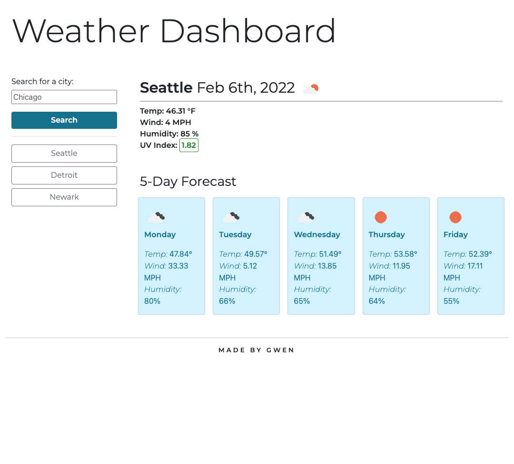

# 06 Server-Side APIs: Weather Dashboard

## Description

Below you will find the weather search app I coded using the [OpenWeather API](https://openweathermap.org/api/one-call-api). When the user opens my application, they are shown an input box where they can type any city in the world and get the current tempurature, wind speed, humidity and UV index -- if the current UV index is within a safe range, it will show as green, if it's moderate, it will show as yellow, and if it's high, it will show as red. The user will also see the 5-day forecast for the city they searched.

The previous city searches are saved in local storage and will show on the left hand side as buttons, and if a search history button is clicked, that city's weather information will populate in the application.

## Screenshot

## Links to Application

- Here is the repo: [gwenewasko/repo](https://github.com/gwenewasko/hw6)
- Here is the page: [gwenewasko/pages](https://gwenewasko.github.io/hw6/)
